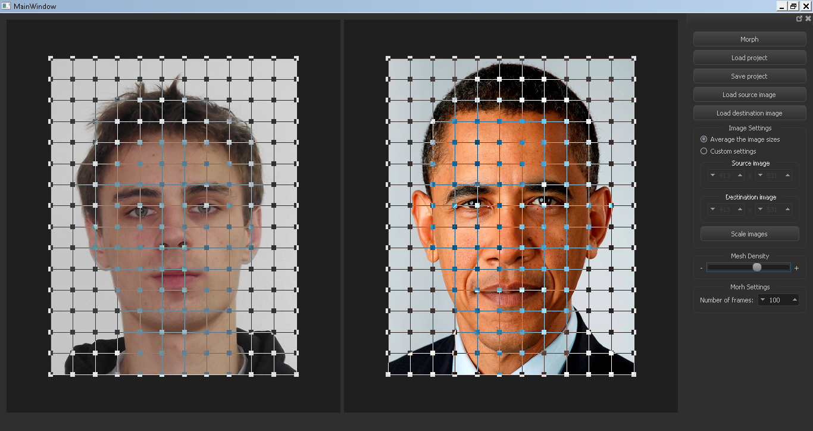
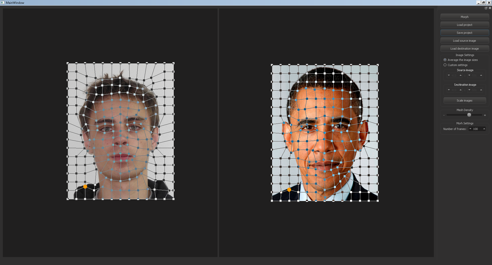
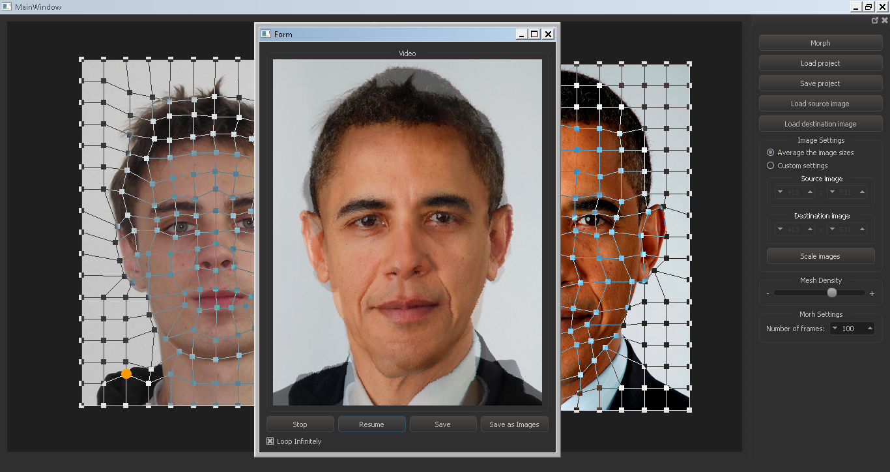

# What is this program ?

This program is a school project to image processing course. It enables user
to morph two images and export the result as an avi file or as a sequence of images.

# How it works ?

The heart of the program is the mesh warping algorithm, which uses a controlling
mesh to define the non-linear transformation of the underlying image. In this
program the points of the mesh are connected with polylines. Another possibility
is to have the points of the mesh connected with curves.

The input of the warping algorithm is the the image to be warped, the source mesh
and the destination mesh. The source mesh defines the original transformation of
the image, i.e. for non deformed image it consists of all straight lines.
The destination mesh defines the final transformation of the image.

The algorithm first computes intersections of the source and the destination mesh
with rows and columns of the image. This way it finds out the source and destination
range of pixels and the just simply remaps the source range to the destination range.

This resampling the can be done in various ways. To get a higher quality result
one would best use some type of interpolation. This program does it the simple
way and uses only nearest neighbour interpolation, i.e. mathematical rounding. 

Morphing is then basically just series of warpings. It first interpolates
between the mesh of the source and the destination image to get a temporary
intermediate mesh. This temporary mesh is then used as the destination mesh
when warping the source and the destination image. Finally both warped images
are blended together to create a single frame of the morph sequence. 

# Other features

- The program enables user to save his unfinished work into a project file and
  then to load it at a later time to continue working  
- At any time during the process of defining the mesh user can preview the result
- Resulting morph can be saved as AVI video or as a sequence of separate images
- For easier editing of large images user can pan and zoom
- The point of the controlling mesh that is currently being edited is for easier
  navigation highlighted in both source and destination mesh
  
# Screenshots

